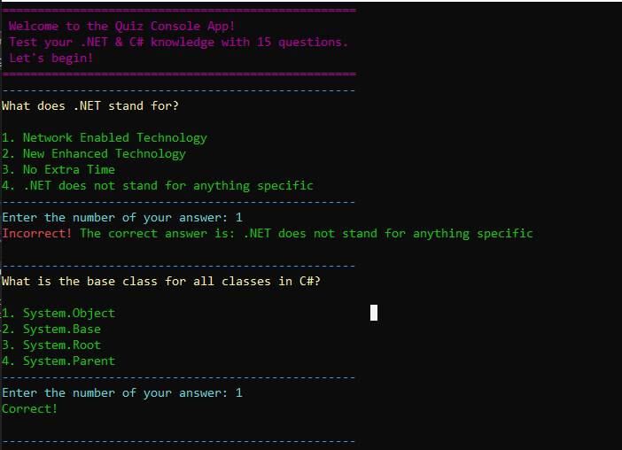

# Quiz Console Application




---
## Purpose of the Program 

This console application allows users to take a quiz on .NET and C# programming language concepts. Each question is presented with multiple-choice answers, and the user's score is calculated based on the correctness of their responses. The program includes a timer for each question to ensure timely responses.

---
## How to Run the Program

1. Clone the repository to your local machine.
2. Navigate to the directory containing the program files.
3. Compile the program using a C# compiler such as `dotnet build`.
4. Run the compiled program using `dotnet run`.
5. Follow the on-screen instructions to take the quiz.

---
## Additional Information

- The quiz consists of 10 questions related to .NET and C# programming.
- Each question has a time limit of 10 seconds for the user to provide an answer.
- Correct and incorrect answers are indicated during the quiz.
- The final score is displayed at the end of the quiz.

---

## Example output:

```
==================================================
 Welcome to the Quiz Console App! 
 Test your .NET & C# knowledge with 15 questions.
 Let's begin!
==================================================
--------------------------------------------------
What does .NET stand for?
1. Network Enabled Technology
2. New Enhanced Technology
3. No Extra Time
4. .NET does not stand for anything specific
--------------------------------------------------
Enter the number of your answer: 4
Correct!

==================================================
Your final score is: 12/15
==================================================
Press [Enter] to exit...
